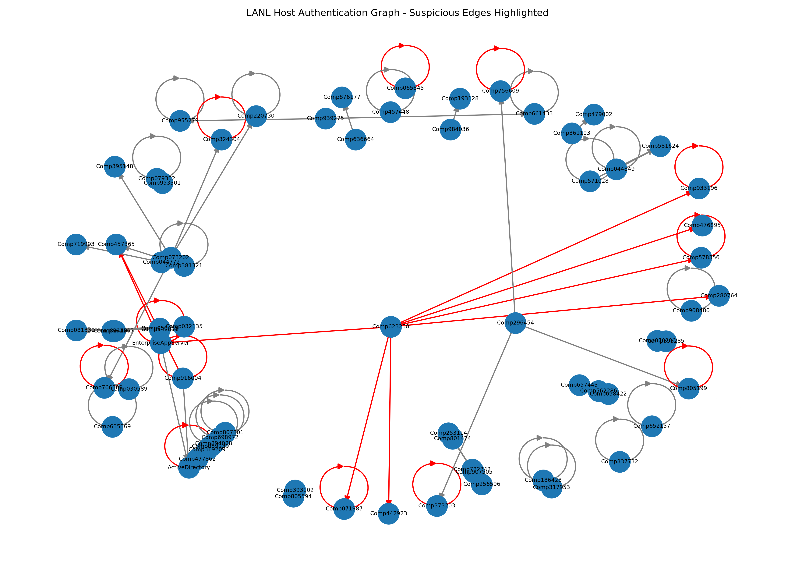

# Graph-Based ML for Lateral Movement Detection

This project is a small cybersecurity machine learning proof-of-concept focused on detecting possible lateral movement in enterprise networks using graph-based features.

Lateral movement is difficult to identify because attackers often use valid credentials and move through normal internal systems. A single login event may not look suspicious on its own, but when multiple authentication events are connected together, the overall path can reveal unusual behavior.

For this project, I use `wls_day-01.bz2` from the LANL Unified Host and Network Dataset. The file contains de-identified Windows host event logs from an enterprise environment. Authentication-related events are extracted and converted into a directed graph of host-to-host activity.

## Problem

Traditional log analysis often looks at individual events separately. However, lateral movement is usually more visible when events are viewed as a sequence or relationship between systems.

For example, a user authenticating from one workstation to several different internal hosts may not immediately prove malicious activity, but it can be useful as a signal for further investigation.

This project explores whether graph-based features can help identify unusual authentication patterns that may be related to lateral movement.

## Approach

The project follows a simple pipeline:

1. Load LANL Windows host event logs.
2. Filter authentication-related events.
3. Build a directed graph using source and destination hosts.
4. Extract graph-based and event-based features.
5. Apply Isolation Forest anomaly detection.
6. Save the suspicious events and graph visualization.

## Dataset

Dataset used:

- LANL Unified Host and Network Dataset
- File: `wls_day-01.bz2`

The raw dataset file is not included in this repository because of its size. To run the project, download the dataset separately and place it in the `data/` folder.

Expected path:

```text
data/wls_day-01.bz2
```

Dataset source: LANL Unified Host and Network Dataset  
Link: https://csr.lanl.gov/data/2017/

## Event IDs Used

This project focuses on authentication-related Windows event IDs:

| Event ID | Description |
|---|---|
| 4624 | Successful logon |
| 4625 | Failed logon |
| 4648 | Logon attempted using explicit credentials |
| 4672 | Special privileges assigned |

## Graph Construction

The LANL host events are converted into a directed graph.

- Nodes represent hosts or systems.
- Edges represent authentication activity between source and destination hosts.
- Suspicious edges are highlighted in red in the graph visualization.

Self-loops, where the source and destination are the same host, can be removed or analyzed separately depending on the use case. For lateral movement detection, host-to-host movement is usually more useful than same-host activity.

## Features Used

The anomaly detection model uses a mix of graph-based and event-based features, including:

- Edge frequency
- Number of unique destinations per user
- Number of unique sources per user
- Source host out-degree
- Destination host in-degree
- Failed logon indicator
- Explicit credential logon indicator
- Special privilege indicator

These features help describe how common or unusual a particular authentication pattern is within the graph.

## Model

This project uses an Isolation Forest model to detect unusual authentication behavior.

Isolation Forest works well for this proof-of-concept because the dataset does not provide confirmed labels for every suspicious event. Instead of training the model to classify events as malicious or benign, the model looks for events that behave differently from the majority of authentication activity.

The output should be interpreted as anomaly-based alerts, not confirmed attacks.

## Results

The project successfully processes LANL Windows host authentication events and creates a directed graph of host-to-host authentication activity.

The graph visualization highlights suspicious edges in red. These red edges represent source-to-destination authentication patterns flagged as anomalous by the Isolation Forest model.



Some of the suspicious patterns identified by the model include:

- Rare source-to-destination authentication edges
- Hosts connecting to multiple different destination hosts
- Events involving failed logons or explicit credential use
- High-degree nodes that may represent unusual movement behavior or administrative activity

The results show that graph-based features can provide useful signals for identifying abnormal authentication behavior. In a real SOC or threat hunting workflow, these alerts would need to be reviewed by an analyst before being treated as security incidents.

## Technologies Used

- Python
- Pandas
- NetworkX
- Scikit-learn
- Matplotlib
- Isolation Forest

## Project Structure

```text
graph-based-lateral-movement-detection/
│
├── README.md
├── requirements.txt
├── .gitignore
│
├── data/
│   └── wls_day-01.bz2        # not included in repository
│
├── src/
│   ├── main.py
│   └── inspect_dataset.py
│
└── outputs/
    └── network_graph.png
```

Generated CSV outputs are created locally when the project is run, but they are not required to be uploaded to GitHub.

## How to Run

Install the required dependencies:

```bash
pip install -r requirements.txt
```

Place the LANL dataset file in the `data/` folder:

```text
data/wls_day-01.bz2
```

Run the project:

```bash
python src/main.py
```

## Outputs

After running the project, the following files are generated:

| Output File | Description |
|---|---|
| `outputs/processed_auth_events.csv` | Filtered authentication-related LANL events |
| `outputs/anomaly_results.csv` | Events with anomaly scores and suspicious labels |
| `outputs/network_graph.png` | Graph visualization with suspicious edges highlighted |

## Future Improvements

- Use multiple days of LANL host event data.
- Add time-window based graph analysis.
- Remove or separately analyze self-loop authentication events.
- Add GraphSAGE or another Graph Neural Network model.
- Compare different anomaly detection models.
- Build a simple dashboard for analyst review.
- Add SIEM-style alert explanations.

## Disclaimer

This project is for academic purposes only.

The suspicious events detected by the model are not confirmed attacks. They are anomaly-based alerts that would require further investigation by a security analyst.
